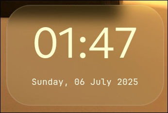
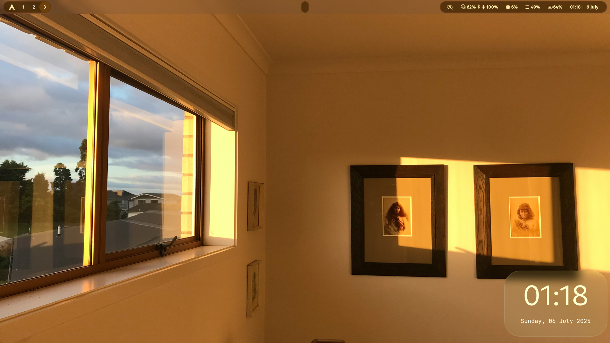

# Eww Widgets
Minimal Aesthetic Time and Date widget.
## Screenshots  


  
# Installation
1. Install [eww](https://github.com/elkowar/eww) (Elkowars Wacky Widgets)
2. Clone this repository into `~/.config/eww`
```
git clone https://github.com/AnkithAbhayan/eww-widgets ~/.config/eww/
```
3. Run the widget with the following commands:
```
eww daemon
eww open clock_win
```
  
## Note
- Uses the [JetBrainsMono](https://www.jetbrains.com/lp/mono) font for the the date label.
- Optimized for environments with a compositor supporting window blur effects.
  
For **Hyprland** users, add the following configuration to your `hyprland.conf` file:
```
layerrule = blur, eww-blur
layerrule = ignorealpha 0.03, eww-blur
```
The `blur` rule enables a translucent blur effect for the widget's background.
The `ignorealpha 0.03` rule removes unwanted blur around the widget's rounded borders, ensuring clean edges.